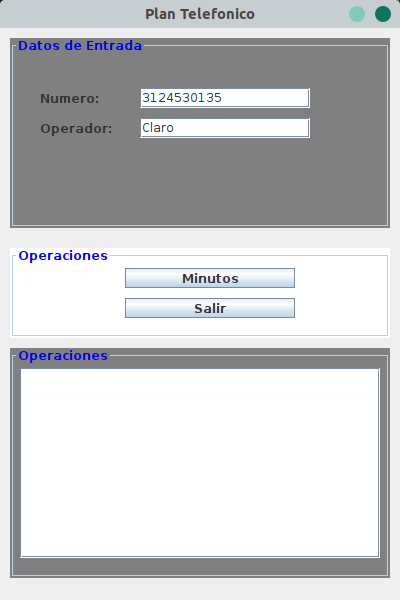
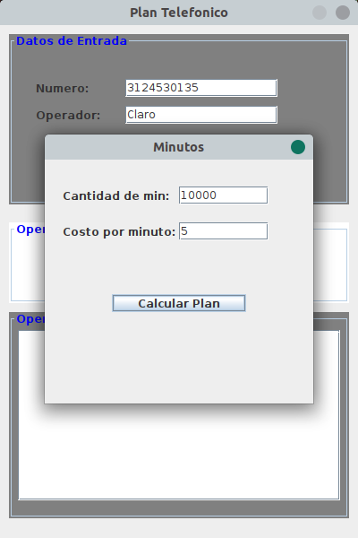
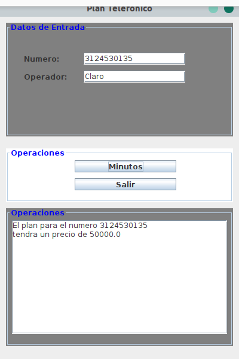
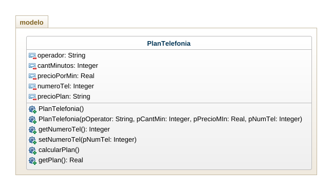

Realice el análisis(identificación de clases, atributos,métodos), diseño(Diagrama de clases) y construcción(al menos mockups) de la siguiente situación:

Crear un programa para gestionar un plan de telefonía móvil. EL plan tiene un numero de celular, un operador, una cantidad de minutos y un costo por minuto, Calcular el total a pagar teniendo en cuenta que si el operador es “movilujo” tiene un 50% de descuento. Usar mínimo dos métodos constructores.

