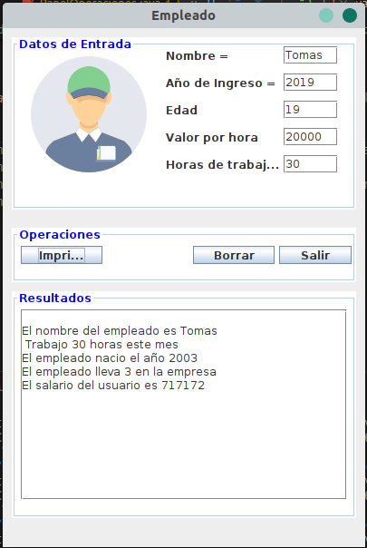
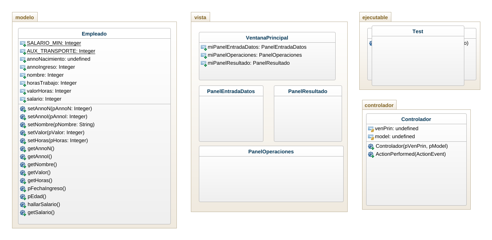

# Caso empresa

Una empresa desea conocer el total a pagar por concepto de salarios a sus empleados.Cada empleado trabaja un numero de horas mensuales y recibe una valoracion por esa hora de trabajo. Si el empleado gana menos de 2 salarios minimos, entonces recibe un auxilio de transporte. Adicionalmente, se desea calcular la edad del empleado, a partir de su fecha de nacimiento, y la antiguedad del empleado utilizando su fecha de ingreso a la empresa.

