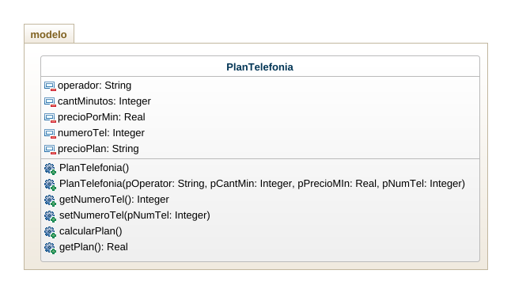
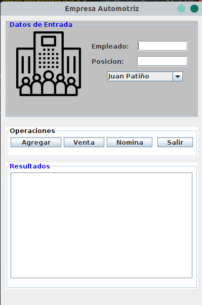
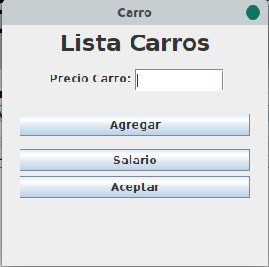
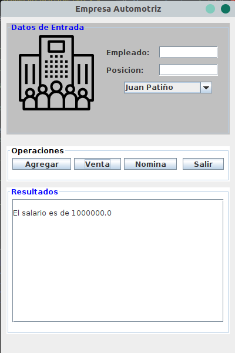

El sueldo que reciben los vendedores de una empresa automotriz está integrado de la siguiente manera: 

-Salario minimo
-$100000 por cada carro vendido
-2% del valor de los carros vendidos.

se tienen varios vendedores, y por cada vendedor se tiene el nombre y el precio de cada carro que vendió en el mes. Es posible que algunos vendedores no hayan realizado venta alguna, en tal caso solo se tendrá el nombre.

Elaborar un programa que permita leer los datos e imprimir el reporte de nomina mensual.

No funciona!

